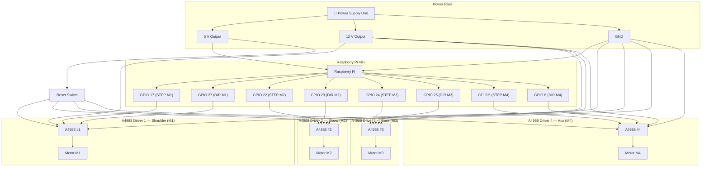
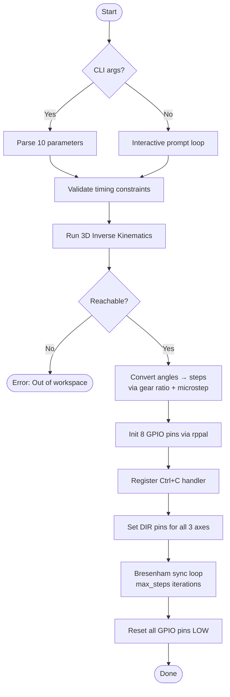
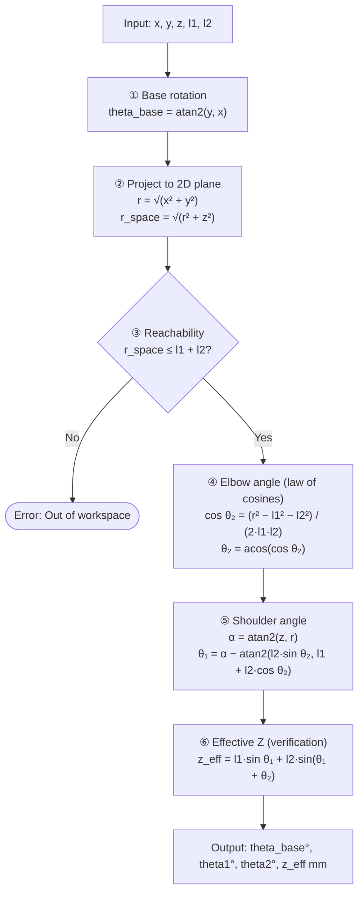
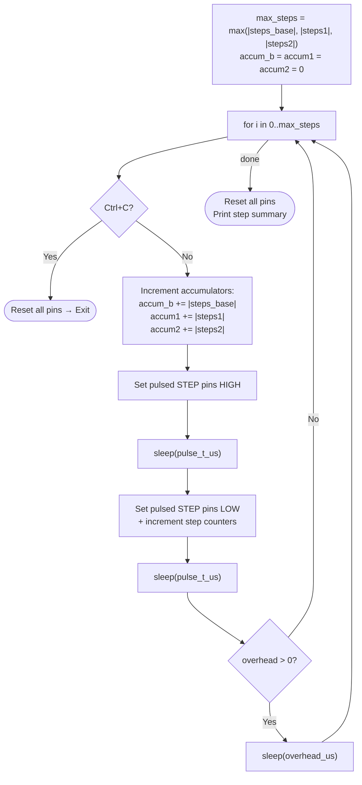

# Roboterarm HASE


> **Open-source robot arm and control software** developed by students of the  
> [Humboldt Academy for Science and Engineering](https://www.hgv.de) at HGV Vaterstetten.

---

## Table of Contents

1. [Team](#1-team)
2. [Project Overview](#2-project-overview)
3. [Hardware](#3-hardware)
   - 3.1 [Bill of Materials](#31-bill-of-materials)
   - 3.2 [Pin Mapping](#32-pin-mapping)
   - 3.3 [Wiring Diagram](#33-wiring-diagram)
   - 3.4 [A4988 Motor Driver Setup](#34-a4988-motor-driver-setup)
   - 3.5 [Microstepping Reference](#35-microstepping-reference)
4. [Software Architecture](#4-software-architecture)
   - 4.1 [Repository Structure](#41-repository-structure)
   - 4.2 [Component Overview](#42-component-overview)
   - 4.3 [rustctl — Main Control Program](#43-rustctl--main-control-program)
   - 4.4 [gpioTest — Hardware Test Utility](#44-gpiotest--hardware-test-utility)
   - 4.5 [Go Webserver (planned)](#45-go-webserver-planned)
5. [Inverse Kinematics](#5-inverse-kinematics)
   - 5.1 [Coordinate System](#51-coordinate-system)
   - 5.2 [Mathematical Model](#52-mathematical-model)
   - 5.3 [Step Conversion](#53-step-conversion)
6. [Motor Synchronization Algorithm](#6-motor-synchronization-algorithm)
7. [Installation & Usage](#7-installation--usage)
   - 7.1 [Prerequisites](#71-prerequisites)
   - 7.2 [Build & Run](#72-build--run)
   - 7.3 [CLI Parameters](#73-cli-parameters)
   - 7.4 [Interactive Mode](#74-interactive-mode)
8. [Known Issues & Limitations](#8-known-issues--limitations)
9. [Future Goals](#9-future-goals)
10. [References](#10-references)

---

## 1. Team

| Member | Role | Status |
|--------|------|--------|
| **Patrick** | Software development, cable management, PCB design | Retired |
| **Luca** | Organisation, Rust development, 3D design & printing, oscilloscope analysis | Active |
| **Johannes** | Go webserver, Linux setup & guide | Active |
| **Florian** | General support across tasks | Active |
| **Julian** | Soldering, calculations & design review | Active |

---

## 2. Project Overview

The **Roboterarm HASE** project builds a fully open-source robotic arm paired with control software running on a [Raspberry Pi 4B+](https://www.raspberrypi.com/products/raspberry-pi-4-model-b/). The arm has **three active degrees of freedom**:

| Axis | Motor | Joint | IK Variable |
|------|-------|-------|-------------|
| Base rotation | M3 | Rotates entire arm around vertical axis | `theta_base` |
| Shoulder | M1 | First rigid link | `theta1` |
| Elbow | M2 | Second rigid link | `theta2` |
| Auxiliary | M4 | Reserved — currently unused | — |

The control software computes **3D inverse kinematics** to translate a target XYZ coordinate in millimeters directly into motor step counts, then drives four [A4988](https://www.pololu.com/file/0J450/A4988.pdf) stepper motor drivers via the Pi's GPIO pins.

The project is funded by sponsors and public grants as part of the school's STEM program.

---

## 3. Hardware

### 3.1 Bill of Materials

| Component | Qty | Purpose | Reference |
|-----------|-----|---------|-----------|
| Stepper Motor (NEMA 17-compatible) | 4 | Drives each axis | — |
| [Raspberry Pi 4B+](https://www.raspberrypi.com/products/raspberry-pi-4-model-b/) | 1 | Main compute unit; runs `rustctl` | — |
| [A4988 Stepper Driver](https://www.pololu.com/product/1182) | 4 | Translates STEP/DIR pulses to motor current | [Datasheet](https://www.pololu.com/file/0J450/A4988.pdf) |
| Power Supply Unit | 1 | Dual-rail: 5 V (logic) + 12 V (motors) | — |
| Arduino Mega | 1 | Oscilloscope signal analysis | — |
| [Rigol DS1052E Oscilloscope](https://www.rigol.eu/products/oscilloscopes/ds1000e/) | 1 | Signal quality verification | — |
| Aluminum extrusion profile | — | Structural frame | — |
| [Bambulab PETG-CF](https://bambulab.com/en/filament/high-speed) | — | Structural 3D-printed parts | — |
| [Bambulab PLA-Matte](https://bambulab.com/en/filament/pla) | — | Non-structural 3D-printed parts | — |
| Reset switch (momentary) | 1 | Shared RESET line across all 4 A4988 drivers | — |
| 100 µF electrolytic capacitor | 4 | VMOT spike suppression (one per A4988) | — |

### 3.2 Pin Mapping

Each A4988 driver needs a **STEP** and **DIR** GPIO signal from the Raspberry Pi.  
All BCM pin numbers reference the [pinout.xyz](https://pinout.xyz) standard.

| Motor | Joint | STEP pin (BCM) | DIR pin (BCM) | Active |
|-------|-------|:--------------:|:-------------:|:------:|
| M1 | Shoulder (Arm 1) | GPIO 17 | GPIO 27 | ✅ |
| M2 | Elbow (Arm 2) | GPIO 22 | GPIO 23 | ✅ |
| M3 | Base rotation | GPIO 24 | GPIO 25 | ✅ |
| M4 | Auxiliary | GPIO 5 | GPIO 6 | ⬜ unused |

### 3.3 Wiring Diagram



### 3.4 A4988 Motor Driver Setup

The [A4988](https://www.pololu.com/file/0J450/A4988.pdf) is a microstepping driver with a built-in translator. See the [Last Minute Engineers tutorial](https://lastminuteengineers.com/a4988-stepper-motor-driver-arduino-tutorial/) for a full wiring guide.

| Pin | Function | Notes |
|-----|----------|-------|
| **STEP** | Advance one microstep per rising edge | Minimum pulse width: 1 µs |
| **DIR** | Rotation direction | HIGH or LOW |
| **RESET** | Active-low reset | Tie to SLEEP, or connect to shared reset switch |
| **SLEEP** | Low-power mode | Tie HIGH to keep driver active |
| **VMOT** | Motor power (8–35 V) | 12 V in this project |
| **VDD** | Logic power (3–5.5 V) | From Raspberry Pi 3.3 V or 5 V |
| **MS1/MS2/MS3** | Microstepping mode | See table below |
| **A1, A2, B1, B2** | Motor coil outputs | Connect to stepper motor windings |

> [!WARNING]
> Place a **100 µF electrolytic capacitor** close to each driver's VMOT and GND pins to suppress inductive voltage spikes. Without it, the A4988 may be destroyed when motors decelerate.

> [!IMPORTANT]
> Set the **current limit** via the onboard potentiometer before powering the motors. Exceeding the motor's rated current causes overheating. Formula: `V_ref = I_max × 8 × R_sense` (R_sense is typically 0.1 Ω on clone boards → `V_ref = 0.8 × I_max`).

### 3.5 Microstepping Reference

| MS1 | MS2 | MS3 | Resolution |
|:---:|:---:|:---:|:----------:|
| LOW | LOW | LOW | Full step |
| HIGH | LOW | LOW | 1/2 step |
| LOW | HIGH | LOW | 1/4 step |
| HIGH | HIGH | LOW | 1/8 step |
| HIGH | HIGH | HIGH | **1/16 step** ← project default |

---

## 4. Software Architecture

### 4.1 Repository Structure

```
Roboterarm-HASE/
├── rustctl/                     ← Main control program
│   ├── Cargo.toml
│   └── src/main.rs
├── gpioTest/                    ← Early GPIO motor test
│   ├── Cargo.toml
│   └── src/main.rs
├── VI21-Anlagen/                ← Project documentation assets
│   ├── Assembly 1 Drawing 1.svg
│   ├── Render1.png
│   ├── 50kPulseLongTimeAnalysis.png
│   ├── DS1ET210300369_0.jpg
│   └── 0001-0520.avi
├── renderer*.blend              ← Blender 3D models (v1–v4)
├── inverseKinematics.ods        ← LibreOffice IK prototype spreadsheet
├── pins.md                      ← Cable/pin mapping reference
├── A4988.png                    ← A4988 driver pinout image
├── pinout.xyz.png               ← Raspberry Pi GPIO pinout image
├── compile.cmd                  ← Cross-compile script (Go → ARM)
└── arduino-oscilloscope/        ← Submodule: Arduino oscilloscope
```

### 4.2 Component Overview


### 4.3 rustctl — Main Control Program

**Language:** Rust (edition 2024) | **Crates:** [`rppal`](https://docs.rs/rppal/latest/rppal/) `0.22.1`, [`ctrlc`](https://docs.rs/ctrlc/latest/ctrlc/) `3.5.2`



**Motor mapping:**

| Variable | GPIO STEP | GPIO DIR | Joint | IK Angle |
|----------|:---------:|:--------:|-------|----------|
| `m1` | 17 | 27 | Shoulder | `theta1` |
| `m2` | 22 | 23 | Elbow | `theta2` |
| `m3` | 24 | 25 | Base rotation | `theta_base` |
| `m4` | 5 | 6 | Auxiliary | *(unused)* |

### 4.4 gpioTest — Hardware Test Utility

**Language:** Rust (edition 2024) | **Crates:** [`rppal`](https://docs.rs/rppal/latest/rppal/) `0.22.1`

An early-stage test used to verify that stepper motors respond to GPIO pulses before the IK logic was written. Key differences from `rustctl`:

| Feature | gpioTest | rustctl |
|---------|:--------:|:-------:|
| Inverse kinematics | ❌ | ✅ |
| DIR pin control | ❌ | ✅ |
| Multi-axis synchronization | ❌ | ✅ |
| Graceful shutdown (Ctrl+C) | ❌ | ✅ |
| Argument parsing | ❌ | ✅ |
| Infinite loop | ✅ | ❌ |

> [!WARNING]
> `gpioTest` has no graceful shutdown handler. To stop it, use `kill <PID>` or a hardware reset. Pins may be left HIGH, keeping a motor coil permanently energized and causing it to overheat.

### 4.5 Go Webserver (planned)

`compile.cmd` shows a cross-compile for Linux ARM:

```bat
set GOOS=linux
set GOARCH=arm
set ARM=6
go build -o core
```

A Go-based webserver (`hw-controller`) was planned to provide a browser UI for sending target coordinates. **No Go source files currently exist in the repository.** This is the most impactful missing component — see [Future Goals](#9-future-goals).

---

## 5. Inverse Kinematics

> See also: [Wikipedia — Inverse Kinematics](https://en.wikipedia.org/wiki/Inverse_kinematics), [inverseKinematics.ods](inverseKinematics.ods)

### 5.1 Coordinate System

The arm is modeled as a **2-link planar manipulator** rotating around the vertical (Z) axis:

| Axis | Direction | Meaning |
|------|-----------|---------|
| X | Right | Horizontal reach (0° base) |
| Y | Forward | Horizontal reach (90° base) |
| Z | Up | Vertical height |
| Origin | — | Center of arm base |

The base rotation motor (M3) swings the entire shoulder–elbow plane around Z. The shoulder (M1) and elbow (M2) then move within that plane.

### 5.2 Mathematical Model

**Function:** `ik_angles_3d_deg(x, y, z, l1, l2) → (theta_base, theta1, theta2, z_eff)`



All angles are returned in **degrees**. The `clamp(-1.0, 1.0)` before `acos` prevents NaN from floating-point rounding errors near the workspace boundary.

### 5.3 Step Conversion

**Function:** `deg_to_steps(angle_deg, steps_per_rev, microstep) → i64`

$$\text{steps} = \text{angle} \times \frac{\text{steps\_per\_rev} \times \text{microstep}}{360°} \times \text{GEAR\_RATIO}$$

| Constant | Value | Notes |
|----------|:-----:|-------|
| `GEAR_RATIO` | 16.0 | Hardcoded 16:1 reduction gearbox |
| `steps_per_rev` | 200 | Typical for 1.8°/step NEMA 17 |
| `microstep` | 16 | 1/16 microstepping (MS1+MS2+MS3 all HIGH) |

> [!NOTE]
> With the above defaults: **1° of joint angle = 142.2 motor steps**.  
> The **sign** of the result selects the direction; `set_direction()` maps positive/negative to HIGH/LOW on the DIR pin based on the `ccw_positive` flag.

---

## 6. Motor Synchronization Algorithm

The movement loop uses a **[Bresenham-like](https://en.wikipedia.org/wiki/Bresenham%27s_line_algorithm) integer accumulator** to distribute steps across three axes so they all start and finish simultaneously — achieving synchronized, coordinated motion.



**Timing constraints:**

| Parameter | Description | Constraint |
|-----------|-------------|------------|
| `total_time` | Target period per tick (µs) | ≥ `2 × pulse_t_us + 83` |
| `pulse_t_us` | STEP pulse HIGH/LOW width (µs) | ≥ 1 µs ([A4988 minimum](https://www.pololu.com/file/0J450/A4988.pdf)) |
| `overhead` | Remaining idle time per tick | `total_time − 2×pulse_t_us − 83` |

The 83 µs constant accounts for measured code overhead (mutex lock/unlock, loop bookkeeping).

---

## 7. Installation & Usage

### 7.1 Prerequisites

| Requirement | How to get it |
|-------------|---------------|
| Raspberry Pi 4B+ running Raspberry Pi OS | [raspberrypi.com/software](https://www.raspberrypi.com/software/) |
| Rust toolchain (stable) | `curl --proto '=https' --tlsv1.2 -sSf https://sh.rustup.rs \| sh` → [rustup.rs](https://rustup.rs) |
| GPIO access | Run with `sudo`, or add user to `gpio` group: `sudo usermod -aG gpio $USER` |
| Hardware wired correctly | See [Section 3](#3-hardware) |

> [!TIP]
> To avoid running with `sudo`, create a udev rule:  
> `echo 'SUBSYSTEM=="gpio", GROUP="gpio", MODE="0660"' | sudo tee /etc/udev/rules.d/99-gpio.rules`  
> Then log out and back in.

### 7.2 Build & Run

```bash
git clone https://github.com/HASE-HGV/Roboterarm-HASE.git
cd Roboterarm-HASE/rustctl
cargo build --release
sudo ./target/release/rustctl
```

Cross-compiling from a non-Pi machine (e.g. a laptop):

```bash
# Install the ARM64 target
rustup target add aarch64-unknown-linux-gnu

# Build
cargo build --release --target aarch64-unknown-linux-gnu

# Copy to Pi and run
scp target/aarch64-unknown-linux-gnu/release/rustctl pi@<IP>:~/
ssh pi@<IP> "sudo ./rustctl"
```

### 7.3 CLI Parameters

```
rustctl <total_time_µs> <pulse_t_µs> <x_mm> <y_mm> <z_mm> <l1_mm> <l2_mm> <steps_per_rev> <microstep> <ccw_positive>
```

| # | Parameter | Type | Description |
|---|-----------|------|-------------|
| 1 | `total_time_µs` | `u64` | Target duration of each step cycle in microseconds (controls speed) |
| 2 | `pulse_t_µs` | `u64` | STEP pulse HIGH duration in microseconds (min 1 µs) |
| 3 | `x_mm` | `f64` | Target X coordinate in millimeters |
| 4 | `y_mm` | `f64` | Target Y coordinate in millimeters (drives base rotation) |
| 5 | `z_mm` | `f64` | Target Z coordinate in millimeters |
| 6 | `l1_mm` | `f64` | Arm segment 1 length: shoulder to elbow (mm) |
| 7 | `l2_mm` | `f64` | Arm segment 2 length: elbow to TCP (mm) |
| 8 | `steps_per_rev` | `u64` | Motor full-step count per revolution (typically `200`) |
| 9 | `microstep` | `u64` | Microstepping divisor set on A4988: `1`, `2`, `4`, `8`, or `16` |
| 10 | `ccw_positive` | `0`/`1` | `1` = CCW is positive direction, `0` = CW is positive |

**Example** — Move to X=100 mm, Y=0 mm, Z=50 mm with 200 mm arm segments:

```bash
sudo ./target/release/rustctl 1000 200 100 0 50 200 200 200 16 1
```

### 7.4 Interactive Mode

Run without arguments to be guided through each parameter interactively:

```bash
sudo ./target/release/rustctl
```

```
=== Interaktiver Modus (Keine CLI-Argumente übergeben) ===
Gesamtzeit pro Schrittperiode (µs) [z.B. 1000]: 1000
Puls-Dauer (µs) [z.B. 200]: 200
Ziel X (mm): 100
Ziel Y (mm) [Basis-Rotation]: 0
Ziel Z (mm): 50
...
```

Invalid inputs are rejected and re-prompted. Press **Ctrl+C** at any time to stop all motors safely.

---

## 8. Known Issues & Limitations

| # | Issue | Severity | Details |
|---|-------|:--------:|---------|
| 1 | **No homing / calibration** | 🔴 High | No limit switches or encoders. Absolute position is unknown at startup; open-loop errors accumulate. |
| 2 | **No position tracking** | 🔴 High | Steps are commanded but not confirmed. Missed steps or stalls go undetected. |
| 3 | **No acceleration / deceleration** | 🟠 Medium | Constant-speed steps; sudden starts can cause missed steps at higher speeds. |
| 4 | **No workspace boundary enforcement** | 🟠 Medium | Only `r_space ≤ l1+l2` is checked. No joint angle limits, no minimum reach, no collision zone checks. |
| 5 | **Motor M4 is unused** | 🟠 Medium | GPIO 5/6 initialized but never commanded. No IK axis assigned. |
| 6 | **Go webserver missing** | 🟠 Medium | `compile.cmd` and CONTRIBUTING.md reference it, but no Go source files exist in the repo. |
| 7 | **Gear ratio hardcoded** | 🟡 Low | `GEAR_RATIO = 16.0` in `deg_to_steps()` should be a CLI or config parameter. |
| 8 | **No Python code despite CI** | 🟡 Low | GitHub Actions workflow runs Python lint/tests; no Python code exists in the repo. |
| 9 | **CONTRIBUTING.md references missing folders** | 🟡 Low | Lists `hw-controller` and `hw-sim` directories that were never created. |
| 10 | **gpioTest has no graceful shutdown** | 🟡 Low | Pins may be left HIGH on exit, keeping a motor coil energized and causing overheating. |

---

## 9. Future Goals

### Short-Term (Next Semester)

- **Homing sequence**  
  Add [limit switches](https://www.pololu.com/category/132/switches) or hall-effect sensors to all three active axes. On startup, each axis moves toward its zero position until it triggers its sensor, establishing an absolute reference frame.

- **Go webserver implementation**  
  Build the planned `hw-controller` in Go: a REST API that accepts `{ x, y, z }` JSON over HTTP and pipes parameters to `rustctl`. A minimal browser UI (HTML + JS) would let any device on the network control the arm without SSH access.

- **Motor M4 end-effector**  
  Assign M4 to a gripper or wrist-roll joint. Extend the IK model and add `grip_open` / `grip_close` commands to the CLI and webserver API.

- **Configurable gear ratio**  
  Replace the hardcoded `GEAR_RATIO = 16.0` with a CLI flag or a `config.toml` so the software is hardware-independent.

---

### Medium-Term

- **Acceleration / deceleration profiles**  
  Implement a trapezoidal or [S-curve ramp](https://www.linearmotiontips.com/how-to-calculate-velocity-s-curve-motion-profile/) in the step loop so motors accelerate smoothly at the start and decelerate before stopping. This eliminates the primary source of missed steps.

- **Closed-loop position feedback**  
  Add [magnetic rotary encoders](https://www.pololu.com/category/165/magnetic-encoders) (e.g. AS5600 via I²C) to each axis. Compare commanded vs. actual angle and implement a PID correction loop to compensate for missed steps.

- **Joint angle limits**  
  Enforce per-axis `[min_deg, max_deg]` bounds in software. Also add the minimum-reach singularity check: `r_space > |l1 - l2|`.

- **Cartesian path planning (linear interpolation)**  
  Split a move into `N` small IK waypoints spaced evenly in Cartesian space, ensuring the TCP travels in a straight line rather than an arc. Essential for precise assembly or drawing tasks.

- **GPIO simulator for development**  
  Create the `hw-sim` component: a mock `rppal` GPIO layer that logs and visualizes STEP/DIR pulses on a laptop without hardware. Enables development and testing of `rustctl` without a Raspberry Pi.

---

### Long-Term

- **[ROS 2](https://docs.ros.org/en/jazzy/) integration**  
  Wrap `rustctl` as a [ROS 2](https://docs.ros.org/en/jazzy/) node and expose the arm as a [MoveIt 2](https://moveit.ros.org/)-compatible manipulator. Unlocks trajectory planning, obstacle avoidance, and integration with vision pipelines.

- **Computer vision pick-and-place**  
  Attach a [Raspberry Pi Camera Module 3](https://www.raspberrypi.com/products/camera-module-3/) and run an object detection model (e.g. [YOLOv8](https://docs.ultralytics.com/)) to autonomously locate and grasp objects placed in the arm's workspace.

- **Web-based 3D simulation**  
  Export the Blender model as [URDF](https://wiki.ros.org/urdf) or [GLTF](https://www.khronos.org/gltf/) and render a live 3D preview of the arm's current pose in the browser alongside the webserver control UI, using [Three.js](https://threejs.org/) or [Babylon.js](https://www.babylonjs.com/).

- **Custom motor controller PCB**  
  Design a Raspberry Pi HAT that integrates all four A4988 drivers, decoupling capacitors, the reset circuit, and status LEDs in a single board — replacing the current breadboard setup with a compact, reliable solution.

- **Multi-arm coordination**  
  Extend the software to coordinate two or more arms over a local network for collaborative assembly tasks.

---

## 10. References

| Resource | Link |
|----------|------|
| A4988 Datasheet | [pololu.com](https://www.pololu.com/file/0J450/A4988.pdf) |
| A4988 Wiring Tutorial | [lastminuteengineers.com](https://lastminuteengineers.com/a4988-stepper-motor-driver-arduino-tutorial/) |
| A4988 Instructables Guide | [instructables.com](https://www.instructables.com/Stepper-Motor-Driverfor-A4988-and-Similar-Devices/) |
| Raspberry Pi GPIO Pinout | [pinout.xyz](https://pinout.xyz) |
| Raspberry Pi 4B+ Specs | [raspberrypi.com](https://www.raspberrypi.com/products/raspberry-pi-4-model-b/specifications/) |
| rppal crate docs | [docs.rs/rppal](https://docs.rs/rppal/latest/rppal/) |
| ctrlc crate docs | [docs.rs/ctrlc](https://docs.rs/ctrlc/latest/ctrlc/) |
| Rust installation | [rustup.rs](https://rustup.rs) |
| Bresenham's line algorithm | [Wikipedia](https://en.wikipedia.org/wiki/Bresenham%27s_line_algorithm) |
| Inverse kinematics | [Wikipedia](https://en.wikipedia.org/wiki/Inverse_kinematics) |
| ROS 2 documentation | [docs.ros.org](https://docs.ros.org/en/jazzy/) |
| MoveIt 2 | [moveit.ros.org](https://moveit.ros.org/) |
| Rigol DS1052E | [rigol.eu](https://www.rigol.eu/products/oscilloscopes/ds1000e/) |

---

*Documentation · June 2026 · [HASE-HGV/Roboterarm-HASE](https://github.com/HASE-HGV/Roboterarm-HASE) · [Open an issue](https://github.com/HASE-HGV/Roboterarm-HASE/issues)*
