# Roboterarm HASE

## About Us:

> Wir sind ein Team aus drei Personen das einen Roboterarm + Steuerungsoftware(im Repo enthalten) bestehend aus  folgenden Person:
>
> Patrick: Software Entwicklung + Kabelmanagement + PCB-DESIGN (RETIRED)
>
> Luca: Organisation + Rust-Development + 3d Design + 3d-Druck + Analyse mittels Arduscope und main.rs
>
> Johannes: Webserver + Linux-Guide
>
> Florian: Hilft bei verschiedenen Aufgaben
>
> Julian: Löthilfe + hilfe bei Rechnungen und Überlegungen

## Unsere Mission:

> Wir wollen eine Open Source Software enwickeln die der Steuerung von Roboterarmen dient. Diese nutzt einen Raspberry-Pi beliebiger Version, in unserem Fall ein Raspberry-Pi 4B+. Zusätzlich bauen wir einen Roboterarm an dem wir dies testen. Finanziert wird dieses Projekt von Sponsoren und Fördergeldern. Wir sind Teil der Humboldt Academy for Science and Engieniering am HGV Vaterstetten.

## Unsere Materialien:

* 4x Stepper Motor
* Raspberry Pi 4B+
* 4x A4988 Motor Driver
* Laptop
* Aloprofile
* Bambulab PETG-CF
* bambulab PLA-Matt
* Oszilloskop (bei uns ein DS1052E von Rigol)
* Arduino Mega

## Programmierung:

> Unser Software besteht aus einem Webserver in Go und einem Control- und Simulations-Programm in Rust unter der Verwendung von ctrlc für graceful shutdowns sowie rppal für ein performantes low-level Interface mit GPIO-pins.

## Usage:

Das Script main.py in hw-controller wird mit folgenden Syntaxen verwenden

## Research:

https://lastminuteengineers.com/a4988-stepper-motor-driver-arduino-tutorial/
https://www.instructables.com/Stepper-Motor-Driverfor-A4988-and-Similar-Devices/
pinout.xyz

Quellen aus der Prhoektdokumentation

## Cables

```mermaid
flowchart TD
    PSU["PSU"]
    
    subgraph PSUModule["Power Supply Unit"]
        PSU --> OUT_5V["5V Output"]
        PSU --> OUT_12V["12V Output"]
        PSU --> GND["GND"]
    end

    subgraph RaspberryPiModule["Raspberry Pi"]
        Raspberry_Pi["Raspberry Pi"]
        Raspberry_Pi --> GPIO17["GPIO17"]
        Raspberry_Pi --> GPIO27["GPIO27"]
        Raspberry_Pi --> GPIO22["GPIO22"]
        Raspberry_Pi --> GPIO23["GPIO23"]
        Raspberry_Pi --> GPIO24["GPIO24"]
        Raspberry_Pi --> GPIO25["GPIO25"]
        Raspberry_Pi --> GPIO5["GPIO5"]
        Raspberry_Pi --> GPIO6["GPIO6"]
    end

    subgraph Driver1Module["Stepper Motor System 1"]
        D1{A4988_1}
        M1{M1}
        RESET_1["RESET_1"]
        GND_1["GND"]
        VMOT_1["12V"]
        STEP_1["STEP"]
        DIR_1["DIR"]
        RESET_1 --> D1
        GND_1 --> D1
        VMOT_1 --> D1
        STEP_1 --> D1
        DIR_1 --> D1
        D1 --> A1_1["A1"] & A2_1["A2"] & B1_1["B1"] & B2_1["B2"] --> M1
    end

    subgraph Driver2Module["Stepper Motor System 2"]
        D2{A4988_2}
        M2{M2}
        RESET_2["RESET_2"]
        GND_2["GND"]
        VMOT_2["12V"]
        STEP_2["STEP"]
        DIR_2["DIR"]
        RESET_2 --> D2
        GND_2 --> D2
        VMOT_2 --> D2
        STEP_2 --> D2
        DIR_2 --> D2
        D2 --> A1_2["A1"] & A2_2["A2"] & B1_2["B1"] & B2_2["B2"] --> M2
    end

    subgraph Driver3Module["Stepper Motor System 3"]
        D3{A4988_3}
        M3{M3}
        RESET_3["RESET_3"]
        GND_3["GND"]
        VMOT_3["12V"]
        STEP_3["STEP"]
        DIR_3["DIR"]
        RESET_3 --> D3
        GND_3 --> D3
        VMOT_3 --> D3
        STEP_3 --> D3
        DIR_3 --> D3
        D3 --> A1_3["A1"] & A2_3["A2"] & B1_3["B1"] & B2_3["B2"] --> M3
    end

    subgraph Driver4Module["Stepper Motor System 4"]
        D4{A4988_4}
        M4{M4}
        RESET_4["RESET_4"]
        GND_4["GND"]
        VMOT_4["12V"]
        STEP_4["STEP"]
        DIR_4["DIR"]
        RESET_4 --> D4
        GND_4 --> D4
        VMOT_4 --> D4
        STEP_4 --> D4
        DIR_4 --> D4
        D4 --> A1_4["A1"] & A2_4["A2"] & B1_4["B1"] & B2_4["B2"] --> M4
    end

    OUT_5V --> Raspberry_Pi
    OUT_5V --> RESET_SWTICH["RESET SWITCH"] --> RESET_1 & RESET_2 & RESET_3 & RESET_4
    OUT_12V --> VMOT_1 & VMOT_2 & VMOT_3 & VMOT_4
    GND --> Raspberry_Pi & GND_1 & GND_2 & GND_3 & GND_4

    GPIO17 --> STEP_1
    GPIO27 --> DIR_1
    GPIO22 --> STEP_2
    GPIO23 --> DIR_2
    GPIO24 --> STEP_3
    GPIO25 --> DIR_3
    GPIO5 --> STEP_4
    GPIO6 --> DIR_4 
```

