# Roboterarm HASE

Dies ist das offizielle Repository von HASE von der Arbeitsgruppe Roboterarm im folgendem wird die Dateistruktur verwendete System usw. beschrieben.

<<<<<<< Updated upstream
### How to use main.py
=======
## Dev

### Lockfiles/PID-Files

sollten in  **/run/roboarm**  gesammelt werden (Nimm auf Windows einf %temp% oder so) PID-Dateien sind programmname.pid, und das einzige was drinnsteht ist die  **P**rocess  **ID**  des Programms. Das erleichtert das Verwalten von laufenden Prozessen und ermöglicht die Verhinderung von Duplikaten z. B.: wenn /run/roboarm/bsp.pid NICHT EXISTIERT: erstells und schreib $PID rein EXISTIERT: fehler ausgeben und exiten

### shebang

Das shebang brauchst du auf linux, wenn du z. B. statt  `python3 main.py`  einfach nur  `main.py`  ausführen können willst Du kannst es setzen indem du in die erste Zeile eines Skripts (bitte keine Binärdateien)  `#! <pfad zum interpreter>`  schreibst z.B. für Python:  `#! /usr/bin/python3`
>>>>>>> Stashed changes

## Cables

```mermaid
sequenceDiagram
A4988 STEP (1) ->> Raspberry Pi GPIO 17: 
A4988 DIR (1) ->> Raspberry Pi GPIO 27: 
A4988 STEP (2) ->> Raspberry Pi GPIO 22: 
A4988 DIR (2) ->> Raspberry Pi GPIO 23: 
A4988 STEP (3) ->> Raspberry Pi GPIO 24:  
A4988 DIR (3) ->> Raspberry Pi GPIO 25:  
A4988 STEP (4) ->> Raspberry Pi GPIO 5:  
A4988 DIR (4) ->> Raspberry Pi GPIO 6: 
Raspberry Pi GPIO 17 ->>Raspberry Pi 0 w: 
Raspberry Pi GPIO 27 ->>Raspberry Pi 0 w: 
Raspberry Pi GPIO 22 ->>Raspberry Pi 0 w: 
Raspberry Pi GPIO 23 ->>Raspberry Pi 0 w: 
Raspberry Pi GPIO 24 ->>Raspberry Pi 0 w: 
Raspberry Pi GPIO 25 ->>Raspberry Pi 0 w: 
Raspberry Pi GPIO 5  ->>Raspberry Pi 0 w: 
Raspberry Pi GPIO 6  ->>Raspberry Pi 0 w: 
A4988 STEP (1) ->> A4988 (1): 
A4988 DIR (1) ->>A4988 (1): 
A4988 STEP (2) ->> A4988 (2):   
A4988 DIR (2) ->>A4988 (2):  
A4988 STEP (3) ->> A4988 (3):   
A4988 DIR (3) ->> A4988 (3):   
A4988 STEP (4) ->> A4988 (4):   
A4988 DIR (4) ->> A4988 (4):   
Netzteil 12V GND ->> A4988 VMOT GND (1): 
Netzteil 12V GND ->> A4988 VMOT GND (2): 
Netzteil 12V GND ->> A4988 VMOT GND (3): 
Netzteil 12V GND ->> A4988 VMOT GND (4): 
Netzteil 12V VMOT ->> A4988 VMOT(1): 
Netzteil 12V VMOT ->> A4988 VMOT(2): 
Netzteil 12V VMOT ->> A4988 VMOT(3): 
Netzteil 12V VMOT ->> A4988 VMOT(4): 
A4988 VMOT GND (1) ->> A4988(1): 
A4988 VMOT(1) ->> A4988(1): 
A4988 VMOT GND (2) ->> A4988(2): 
A4988 VMOT(2) ->> A4988(2): 
A4988 VMOT GND (3) ->> A4988(3): 
A4988 VMOT(3) ->> A4988(3): 
A4988 VMOT GND (4) ->> A4988(4): 
A4988 VMOT(4) ->> A4988(4): 
  
 
```

