# Roboterarm HASE

## About Us:

> Wir sind ein Team aus drei Personen das einen Roboterarm + Steuerungsoftware(im Repo enthalten) bestehend aus  folgenden Person:
>
> Patrick: Software Entwicklung + Kabelmanagement
>
> Luca: Organisation + PCB Layout + 3d Design
>
> Johannes: Webserver (GO Language)

## Unsere Mission:

> Wir wollen eine Open Source Software enwickeln die der Steuerung von Roboterarmen dient. Diese nutzt einen Raspberry Pi beliebiger Version in unserem Fall [Raspberry Pi Zero WH](https://www.raspberrypi.com/products/raspberry-pi-zero-w/). Zusätzlich bauen wir einen Roboterarm an dem wir dies testen. Finanziert wird dieses Projekt von Sponsoren und Fördergeldern. Wir sind Teil der Humboldt Academy for Science and Engieniering am HGV Vaterstetten.

## Unsere Materialien:

* 4x Stepper Motor
* Raspberry Pi Zero WH
* 4x A4988 Motor Driver

## Programmierung:

> Unser Software besteht aus einem Webserver mit GOLANG und einem Controll und Simulations Programm mit Python.

## Usage:

Das Script main.py in hw-controller wird mit folgenden Syntaxen verwenden

## Research:

https://lastminuteengineers.com/a4988-stepper-motor-driver-arduino-tutorial/
https://www.instructables.com/Stepper-Motor-Driverfor-A4988-and-Similar-Devices/

## Cables

```mermaid
sequenceDiagram
A4988 STEP (1) ->> Raspberry Pi GPIO 17: 
A4988 DIR (1) ->> Raspberry Pi GPIO 27: 
A4988 STEP (2) ->> Raspberry Pi GPIO 22: 
A4988 DIR (2) ->> Raspberry Pi GPIO 23: 
A4988 STEP (3) ->> Raspberry Pi GPIO 24:  
A4988 DIR (3) ->> Raspberry Pi GPIO 25:  
A4988 STEP (4) ->> Raspberry Pi GPIO 5:  
A4988 DIR (4) ->> Raspberry Pi GPIO 6: 
Raspberry Pi GPIO 17 ->>Raspberry Pi 0 w: 
Raspberry Pi GPIO 27 ->>Raspberry Pi 0 w: 
Raspberry Pi GPIO 22 ->>Raspberry Pi 0 w: 
Raspberry Pi GPIO 23 ->>Raspberry Pi 0 w: 
Raspberry Pi GPIO 24 ->>Raspberry Pi 0 w: 
Raspberry Pi GPIO 25 ->>Raspberry Pi 0 w: 
Raspberry Pi GPIO 5  ->>Raspberry Pi 0 w: 
Raspberry Pi GPIO 6  ->>Raspberry Pi 0 w: 
A4988 STEP (1) ->> A4988 (1): 
A4988 DIR (1) ->>A4988 (1): 
A4988 STEP (2) ->> A4988 (2):   
A4988 DIR (2) ->>A4988 (2):  
A4988 STEP (3) ->> A4988 (3):   
A4988 DIR (3) ->> A4988 (3):   
A4988 STEP (4) ->> A4988 (4):   
A4988 DIR (4) ->> A4988 (4):   
Netzteil 12V GND ->> A4988 VMOT GND (1): 
Netzteil 12V GND ->> A4988 VMOT GND (2): 
Netzteil 12V GND ->> A4988 VMOT GND (3): 
Netzteil 12V GND ->> A4988 VMOT GND (4): 
Netzteil 12V VMOT ->> A4988 VMOT(1): 
Netzteil 12V VMOT ->> A4988 VMOT(2): 
Netzteil 12V VMOT ->> A4988 VMOT(3): 
Netzteil 12V VMOT ->> A4988 VMOT(4): 
A4988 VMOT GND (1) ->> A4988(1): 
A4988 VMOT(1) ->> A4988(1): 
A4988 VMOT GND (2) ->> A4988(2): 
A4988 VMOT(2) ->> A4988(2): 
A4988 VMOT GND (3) ->> A4988(3): 
A4988 VMOT(3) ->> A4988(3): 
A4988 VMOT GND (4) ->> A4988(4): 
A4988 VMOT(4) ->> A4988(4): 
  
 
```

